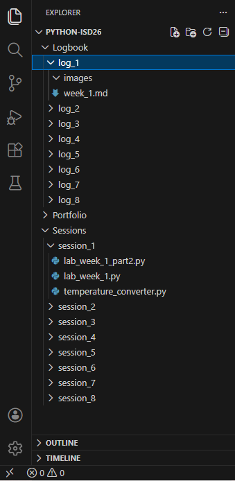

# Session 1: Introduction to Python Programming I

## Section 1 Setting up code editor

### Exercise Task 1 : Setup

Visual Studio code is [here](https://code.visualstudio.com)

### Exercise Task 2 : Working Folder

Download Starter folder from aula

use this Folder Structure



### Exercise Task 3 : Run Demo File

``` Python 
# Your first Python program

print("Hello. Welcome to the ISD Module.")
print("This program has been run successfully.")


class_name = "ISD"
number_of_students = 20
my_string = "Welcome to the " + class_name + " module. There are " + str(number_of_students) + " students in this class."
print(my_string)
my_string = f"Welcome to the {class_name} module. There are {number_of_students} students in this class."
print(my_string)
```
output
``` console
PS C:\Users\raibi\OneDrive\Documents\Python-ISD26> & C:/Users/raibi/AppData/Local/Python/pythoncore-3.14-64/python.exe c:/Users/raibi/OneDrive/Documents/Python-ISD26/Sessions/session_1/lab_week_1.py
Hello. Welcome to the ISD Module.
This program has been run successfully.
Welcome to the ISD module. There are 20 students in this class.
Welcome to the ISD module. There are 20 students in this class.
```

## Section 2 Python Introduction 

### Exercise 1 Task 1 : Variable and Types 

``` Python
# Exercise 1 Task: Variables and Types
var_1 = True # Type:'bool'
var_2 = 1 # Type:'int'
var_3 = 3.14159  # Type:'float'
var_4 = "Hello, World!" # Type:'str'

print(type(var_1))
print(type(var_2))
print(type(var_3))
print(type(var_4))
```

output
``` console
PS C:\Users\raibi\OneDrive\Documents\Python-ISD26> & C:/Users/raibi/AppData/Local/Python/pythoncore-3.14-64/python.exe c:/Users/raibi/OneDrive/Documents/Python-ISD26/Sessions/session_1/lab_week_1_part2.py
<class 'bool'>
<class 'int'>
<class 'float'>
<class 'str'>
```

### Exercise 1 Task 2 : Casting Variables

``` python
# Exercise 1 Task: Casting Variables
my_int = 5
my_float = 5.5
my_bool = True
print("my_int = ", my_int, "my_float = ", my_float, "my_bool = ", my_bool)

my_int_float = float(my_int)
print("my_int_float = ", my_int_float)

my_float_int = int(my_float)
print("my_float_int = ", my_float_int)

my_bool_int = int(my_bool)
print("my_bool_int = ", my_bool_int)
```

Output
``` console
PS C:\Users\raibi\OneDrive\Documents\Python-ISD26> & C:/Users/raibi/AppData/Local/Python/pythoncore-3.14-64/python.exe c:/Users/raibi/OneDrive/Documents/Python-ISD26/Sessions/session_1/lab_week_1_part2.py
my_int =  5 my_float =  5.5 my_bool =  True
my_int_float =  5.0
my_float_int =  5  
my_bool_int =  1
```

### Exercise 2 Task 1 : Arithmetic Operators

``` python
# Exercise 2 Arithmetic operators

#Addition
result_addition = 10 + 5 
print("Addition:", result_addition)

#Subtraction
result_subtraction = 20-8
print("Subtraction:", result_subtraction)

#Multiplication
result_multiplication = 6*4 
print("Multiplication:", result_multiplication)

#Division
result_division = 15 / 3 
print("Division:", result_division)

#Floor Division
result_floor_division = 17 // 4 
print("Floor Division:", result_floor_division)

#Modulus
result_modulus = 17 % 4 
print("Modulus:", result_modulus)

#Exponentiation
result_exponentiation = 2 ** 3 
print("Exponentiation:", result_exponentiation)
```

Output
``` console
PS C:\Users\raibi\OneDrive\Documents\Python-ISD26> & C:/Users/raibi/AppData/Local/Python/pythoncore-3.14-64/python.exe c:/Users/raibi/OneDrive/Documents/Python-ISD26/Sessions/session_1/lab_week_1_part2.py
Addition: 15
Subtraction: 12   
Multiplication: 24
Division: 5.0     
Floor Division: 4 
Modulus: 1        
Exponentiation: 8 
```

### Exercise 2 Task 2 : Calculating the Average

``` python
# Task 2: Calculating the Average:

num1 = 10
num2 = 20
Average = (num1 + num2) / 2
print("the num1 is:", num1)
print("the num2 is:", num2)
print("The average of", num1, "and", num2, "is:", Average)
```

Output
``` console
PS C:\Users\raibi\OneDrive\Documents\Python-ISD26> & C:/Users/raibi/AppData/Local/Python/pythoncore-3.14-64/python.exe c:/Users/raibi/OneDrive/Documents/Python-ISD26/Sessions/session_1/lab_week_1_part2.py
the num1 is: 10
the num2 is: 20
The average of 10 and 20 is: 15.0
```

### Exercise 2 Task 3 : Area of Rectangle

``` python
# Task 3: Calculate the Area of a Rectangle:

length = 5
width = 3
area = length * width
print("The length of the rectangle is:", length)    
print("The width of the rectangle is:", width)
print("The area of the rectangle is:", area)
```

Output
``` console
PS C:\Users\raibi\OneDrive\Documents\Python-ISD26> & C:/Users/raibi/AppData/Local/Python/pythoncore-3.14-64/python.exe c:/Users/raibi/OneDrive/Documents/Python-ISD26/Sessions/session_1/lab_week_1_part2.py
The length of the rectangle is: 5
The width of the rectangle is: 3
The area of the rectangle is: 15
```

### Exercise 3 Task 1 : String and f-String

``` python
# Task 1: Modify Strings:

my_string = "This class covers ISD."
print("The my_string is:", my_string)

my_uppercase_string = my_string.upper()
print("The my_uppercase_string is:", my_uppercase_string)

my_lowercase_string = my_string.lower()
print("The my_lowercase_string is:", my_lowercase_string)

my_new_string = my_string.replace("ISD", "Interactive Software Design")
print("The my_new_string is:", my_new_string)

my_string_length = len(my_string)
print("The my_string_length is:", my_string_length)
```

Output 
``` console 
PS C:\Users\raibi\OneDrive\Documents\Python-ISD26> & C:/Users/raibi/AppData/Local/Python/pythoncore-3.14-64/python.exe c:/Users/raibi/OneDrive/Documents/Python-ISD26/Sessions/session_1/lab_week_1_part2.py
The my_string is: This class covers ISD.
The my_uppercase_string is: THIS CLASS COVERS ISD.
The my_lowercase_string is: this class covers isd.
The my_new_string is: This class covers Interactive Software Design.
The my_string_length is: 22
```

### Exercise 3 Task 2 : f-String

``` python
# Task 2: f-Strings

my_name = "Bibek Rai"
my_number_of_classes = 3
my_campus = "Paisley Campus"

my_text = f"My name is {my_name} and I am studying {my_number_of_classes} classes in {my_campus}"
print(my_text)

```

Output
``` console 
PS C:\Users\raibi\OneDrive\Documents\Python-ISD26> & C:/Users/raibi/AppData/Local/Python/pythoncore-3.14-64/python.exe c:/Users/raibi/OneDrive/Documents/Python-ISD26/Sessions/session_1/lab_week_1_part2.py
My name is Bibek Rai and I am studying 3 classes in Paisley Campus
```

## Section 3 First Temperature Converter Program

``` python
# Section 3: First Program in Python

celsius_input = 25
degree_f = (float(celsius_input) * 9/5) + 32
degree_k = float(celsius_input) + 273.15   
output = f"The Celsius value is: {celsius_input}°C\nThe Fahrenheit value is: {degree_f}°F\nThe Kelvin value is: {degree_k}K"
print(output)

```

Output
``` console
PS C:\Users\raibi\OneDrive\Documents\Python-ISD26> & C:/Users/raibi/AppData/Local/Python/pythoncore-3.14-64/python.exe c:/Users/raibi/OneDrive/Documents/Python-ISD26/Sessions/session_1/temperature_converter.py
The Celsius value is: 25°C     
The Fahrenheit value is: 77.0°F
The Kelvin value is: 298.15K
```
>