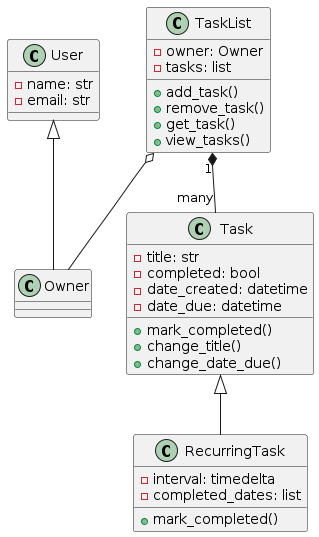
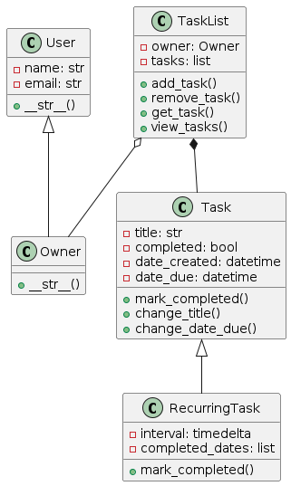

### Task : Portfolio Exercise 1

Add a description attribute to the Task class. This should be a string that describes the task but is
entirely optional for the user of your program to provide. For this, you should:
- add the description attribute to the Task class and allow for it to be passed as a parameter to the
__init__ method.
- add a method called change_description that allows the user to change the description of a task
- change the __str__ method to include the description of the task
- change the main() function to allow the user to change the description of a task in choice 4 where the
user can also change the title and due date of a task 

``` python
# tasks.py
class Task:
    def __init__(self, title, due_date, description=""):
        self.title = title
        self.due_date = due_date
        self.description = description

    def change_title(self, new_title):
        self.title = new_title

    def change_due_date(self, new_due_date):
        self.due_date = new_due_date

    def change_description(self, new_description):
        self.description = new_description

    def __str__(self):
        return f"Title: {self.title}\nDue Date: {self.due_date}\nDescription: {self.description}"
```

``` python
# tasklist.py
from tasks import Task

class TaskList:
    def __init__(self):
        self.tasks = []

    def add_task(self, task):
        self.tasks.append(task)

    def remove_task(self, task):
        if 0 <= task < len(self.tasks):
            del self.tasks[task]
        else:
            print("Invalid task index.")

    def show_tasks(self):
        if len(self.tasks) == 0:
            print("No tasks in the list.")
        else:
            for index, task in enumerate(self.tasks):
                print(f"Task {index + 1}:\n{task}\n")
                
    def edit_task(self, task_index, new_title=None, new_due_date=None, new_description=None):
        if 0 <= task_index < len(self.tasks):
            task = self.tasks[task_index]
            if new_title is not None:
                task.change_title(new_title)
            if new_due_date is not None:
                task.change_due_date(new_due_date)
            if new_description is not None:
                task.change_description(new_description)
        else:
            print("Invalid task index.")
```

``` python 
# main.py
from  tasks import Task
from tasklist import TaskList

def main():
    task_list = TaskList()

    while True: 
        print("1. Add Task")
        print("2. Remove Task")
        print("3. Show Tasks")
        print("4. Edit Task")
        print("5. Exit")

        choice = input("Choose an option: ")

        if choice == '1':
            title = input("Enter task title: ")
            due_date = input("Enter task due date: ")
            description = input("Enter task description (optional): ")
            task = Task(title, due_date, description)
            task_list.add_task(task)
            print("Task added successfully.\n")

        elif choice == '2':
            index = int(input("Enter the task number to remove: ")) - 1
            task_list.remove_task(index)

        elif choice == '3':
            task_list.show_tasks()

        elif choice == '4':
            task_list.show_tasks()
            index = int(input("Enter the task number to edit: ")) - 1
            if 0 <= index < len(task_list.tasks):
                new_title = input("Enter new title (leave blank to keep current): ")
                new_due_date = input("Enter new due date (leave blank to keep current): ")
                new_description = input("Enter new description (leave blank to keep current): ")

                task_list.tasks[index].change_title(new_title)
                task_list.tasks[index].change_due_date(new_due_date)
                task_list.tasks[index].change_description(new_description)   
                print("Task updated successfully.\n")
            else:
                print("Invalid task number.\n")

        elif choice == '5':
            print("Exiting the program.")
            break

        else:
            print("Invalid option. Please try again.\n")

if __name__ == "__main__":    
    main()
```

Output
``` Console
PS C:\Users\raibi\OneDrive\Documents\Python-ISD26> & C:/Users/raibi/AppData/Local/Python/pythoncore-3.14-64/python.exe c:/Users/raibi/OneDrive/Documents/Python-ISD26/Portfolio/exercise_1/src/main.py
1. Add Task
2. Remove Task    
3. Show Tasks     
4. Edit Task      
5. Exit
Choose an option: 1
Enter task title: Java
Enter task due date: 2026-03-30
Enter task description (optional): Qwerty
Task added successfully.

1. Add Task
2. Remove Task
3. Show Tasks
4. Edit Task
5. Exit
Choose an option: 3
Task 1:
Title: Java
Due Date: 2026-03-30
Description: Qwerty

1. Add Task
2. Remove Task
3. Show Tasks
4. Edit Task
5. Exit
Choose an option: 4
Task 1:
Title: Java
Due Date: 2026-03-30
Description: Qwerty

Enter the task number to edit: 1
Enter new title (leave blank to keep current): 
Enter new due date (leave blank to keep current): 2026-04-01
Enter new description (leave blank to keep current): 
Task updated successfully.

1. Add Task
2. Remove Task
3. Show Tasks
4. Edit Task
5. Exit
Choose an option: 3
Task 1:
Title:
Due Date: 2026-04-01
Description:

1. Add Task
2. Remove Task
3. Show Tasks
4. Edit Task
5. Exit
Choose an option: 2
Enter the task number to remove: 1
1. Add Task
2. Remove Task
3. Show Tasks
4. Edit Task
5. Exit
Choose an option: 5
Exiting the program.
```

### Task : Portfolio Exercise 2

Add a method to the TaskList class that allows the user to view all overdue tasks. For this, you
should:
- add a method called view_overdue_tasks that prints all tasks that are overdue based on the
current date.
- change the main() function to allow the user to view all overdue tasks in an additional choice

``` python
# tasks.py
from datetime import datetime

class Task:
    def __init__(self, title, due_date, description=""):
        self.title = title
        self.completed = False
        self.due_created = datetime.now()
        self.due_date = datetime.strptime(due_date, "%Y-%m-%d")
        self.description = description

    def mark_as_completed(self):
        self.completed = True

    def change_title(self, new_title):
        self.title = new_title

    def change_due_date(self, new_due_date):
        self.due_date = new_due_date

    def change_description(self, new_description):
        self.description = new_description

    def __str__(self):
        return f"Title: {self.title}\nDue Date: {self.due_date}\nDescription: {self.description}\nCompleted: {self.completed}"
```

``` python
# tasklist.py
from datetime import datetime

class TaskList:
    def __init__(self, owner):
        self.owner = owner
        self.tasks = []

    def add_task(self, task):
        self.tasks.append(task)

    def remove_task(self, task):
        if 0 <= task < len(self.tasks):
            del self.tasks[task]
        else:
            print("Invalid task index.")

    def view_tasks(self):
        if len(self.tasks) == 0:
            print("No tasks in the list.")
        else:
            for index, task in enumerate(self.tasks):
                print(f"Task {index + 1}:\n{task}\n")
                
    def edit_task(self, task_index, new_title=None, new_due_date=None, new_description=None):
        if 0 <= task_index < len(self.tasks):
            task = self.tasks[task_index]
            if new_title is not None:
                task.change_title(new_title)
            if new_due_date is not None:
                task.change_due_date(new_due_date)
            if new_description is not None:
                task.change_description(new_description)
        else:
            print("Invalid task index.")

    def list_options(self):
        print("1. Add Task")
        print("2. Remove Task")
        print("3. View Tasks")
        print("4. Edit Task")
        print("5. View Overdue Tasks")
        print("6. Exit")

    def view_overdue_tasks(self):
        current_date = datetime.now()
        found = False
        for task in self.tasks:
            if task.due_date < current_date and not task.completed:
                print(task)
                found = True

        if not found:
            print("No overdue tasks found.")
```

``` python
# main.py
from tasks import Task
from tasklist import TaskList

def main():
    task_list = TaskList("John Doe")

    while True:
        task_list.list_options()
        choice = input("Choose an option: ")

        if choice == "1":
            title = input("Enter task title: ")
            due_date = input("Enter due date (YYYY-MM-DD): ")
            description = input("Enter task description (optional): ")
            task = Task(title, due_date, description)
            task_list.add_task(task)

        elif choice == "2":
            index = int(input("Enter task index to remove: ")) - 1
            task_list.remove_task(index)

        elif choice == "3":
            task_list.view_tasks()

        elif choice == "4":
            index = int(input("Enter task index to edit: ")) - 1
            new_title = input("Enter new title (leave blank to keep current): ")
            new_due_date = input("Enter new due date (YYYY-MM-DD, leave blank to keep current): ")
            new_description = input("Enter new description (leave blank to keep current): ")
            task_list.edit_task(index, new_title or None, new_due_date or None, new_description or None)

        elif choice == "5":
            task_list.view_overdue_tasks()

        elif choice == "6":
            print("Exiting...")
            break

        else:
            print("Invalid option. Please try again.")

if __name__ == "__main__":
    main()
```

Output
``` Console
PS C:\Users\raibi\OneDrive\Documents\Python-ISD26> & C:/Users/raibi/AppData/Local/Python/pythoncore-3.14-64/python.exe c:/Users/raibi/OneDrive/Documents/Python-ISD26/Portfolio/exercise_2/src/main.py
1. Add Task
2. Remove Task       
3. View Tasks        
4. Edit Task
5. View Overdue Tasks
6. Exit
Choose an option: 1  
Enter task title: Java Programming
Enter due date (YYYY-MM-DD): 2026-03-30
Enter task description (optional): qwerty
1. Add Task
2. Remove Task
3. View Tasks
4. Edit Task
5. View Overdue Tasks
6. Exit
Choose an option: 3
Task 1:
Title: Java Programming
Due Date: 2026-03-30 00:00:00
Description: qwerty
Completed: False

1. Add Task
2. Remove Task
3. View Tasks
4. Edit Task
5. View Overdue Tasks
6. Exit
Choose an option: 5
No overdue tasks found.
1. Add Task
2. Remove Task
3. View Tasks
4. Edit Task
5. View Overdue Tasks
6. Exit
Choose an option: 1
Enter task title: Python Programming
Enter due date (YYYY-MM-DD): 2026-03-08
Enter task description (optional): Qwerty
1. Add Task
2. Remove Task
3. View Tasks
4. Edit Task
5. View Overdue Tasks
6. Exit
Choose an option: 5
Title: Python Programming
Due Date: 2026-03-08 00:00:00
Description: Qwerty
Completed: False
1. Add Task
2. Remove Task
3. View Tasks
4. Edit Task
5. View Overdue Tasks
6. Exit
Choose an option: 6
Exiting... 
```

### Task : Portfolio Exercise 3

At the minimum, you should add the following:
- A new class called User. This class should have the following attributes: name, email.
- A new class called Owner. This class should inherit from the User class.
- Modifications to the TaskList class to include an owner attribute. This attribute should be of type
Owner and you should select an appropriate UML relationship between the TaskList and Owner
classes.


``` Python
# tasks.py
import datetime

class Task:
    """Represents a task in a to-do list. <-- this is a class docstring.
    """

    def __init__(self, title: str, date_due: datetime.datetime):
        """Creates a new task. <-- this is a method docstring.

        Args:
            title (str): Title of the task.
            date_due (datetime.datetime): Due date of the task.
        """
        self.title = title
        self.date_created = datetime.datetime.now()
        self.completed = False
        self.date_due = date_due

    def change_title(self, new_title: str) -> None:
        """Changes the title of the task.

        Args:
            new_title (str): New title of the task.
        """
        self.title = new_title

    def change_date_due(self, date_due: datetime.datetime) -> None:
        """Changes the due date of the task.

        Args:
            date_due (datetime.datetime): New due date of the task.
        """
        self.date_due = date_due

    def mark_completed(self) -> None:
        """Marks the task as completed."""

        self.completed = True

    def __str__(self) -> str:
        return f"{self.title} (created: {self.date_created}, due: {self.date_due}, completed: {self.completed})"
    


class RecurringTask(Task):
    """Represents a recurring task in a to-do list.

    Args:
        Task (Task): The task to be repeated.
    """

    def __init__(self, title: str, date_due: datetime.datetime, interval: datetime.timedelta):
        """Creates a new recurring task.

        Args:
            title (str): Title of the task.
            date_due (datetime.datetime): Due date of the task.
            interval (datetime.timedelta): Interval between each repetition.
        """
        super().__init__(title, date_due)
        self.interval = interval
        self.completed_dates : list[datetime.datetime] = [] # type hinting that completed_dates is a list of datetime.datetime objects
    
    def _compute_next_due_date(self) -> datetime.datetime:
        """Computes the next due date of the task.

        Returns:
            datetime.datetime: The next due date of the task.
        """
        return self.date_due + self.interval

    def mark_completed(self) -> None:
        """Marks the task as completed."""
        self.completed_dates.append(datetime.datetime.now())
        self.date_due = self._compute_next_due_date()
    
    def __str__(self) -> str:
        return f"{self.title} - Recurring (created: {self.date_created}, due: {self.date_due}, completed: {self.completed_dates}, interval: {self.interval})"
```

``` Python
# tasklist.py
from tasks import Task
import datetime

class TaskList:
    def __init__(self, owner: str):
        """Creates a new task list. This contains a list of tasks.

        Args:
            owner (str): Owner of the task list.
        """
        self.owner = owner
        self.tasks: list[Task] = []

    def get_task(self, ix: int) -> Task:
        return self.tasks[ix]

    def add_task(self, task: Task) -> None:
        self.tasks.append(task)

    def remove_task(self, ix: int) -> None:
        del self.tasks[ix]

    def view_tasks(self) -> None:
        print(f"Task list for {self.owner}:")
        for ix, task in enumerate(self.tasks):
            print(f"{ix}: {task}")
```

``` Python
# main.py
from tasklist import TaskList
from tasks import Task, RecurringTask
import datetime

def propagate_task_list(task_list: TaskList) -> TaskList:
    """Propagates a task list with some sample tasks.

    Args:
        task_list (TaskList): Task list to propagate.

    Returns:
        TaskList: The propagated task list.
    """
    task_list.add_task(Task("Buy groceries", datetime.datetime.now() - datetime.timedelta(days=4)))
    task_list.add_task(Task("Do laundry", datetime.datetime.now() - datetime.timedelta(days=-2)))
    task_list.add_task(Task("Clean room", datetime.datetime.now() + datetime.timedelta(days=-1)))
    task_list.add_task(Task("Do homework", datetime.datetime.now() + datetime.timedelta(days=3)))
    task_list.add_task(Task("Walk dog", datetime.datetime.now() + datetime.timedelta(days=5)))
    task_list.add_task(Task("Do dishes", datetime.datetime.now() + datetime.timedelta(days=6)))


    # sample recurring task
    r_task = RecurringTask("Go to the gym", datetime.datetime.now(), datetime.timedelta(days=7))
    # propagate the recurring task with some completed dates
    r_task.completed_dates.append(datetime.datetime.now() - datetime.timedelta(days=7))
    r_task.completed_dates.append(datetime.datetime.now() - datetime.timedelta(days=14))
    r_task.completed_dates.append(datetime.datetime.now() - datetime.timedelta(days=22))
    r_task.date_created = datetime.datetime.now() - datetime.timedelta(days=28)

    task_list.add_task(r_task)

    return task_list


def main() -> None:
    task_list = TaskList("YOUR NAME")

    # propagate the task list with some sample tasks
    task_list = propagate_task_list(task_list)


    while True: 
        print("To-Do List Manager") 
        print("1. Add a task") 
        print("2. View tasks") 
        print("3. Remove a task")
        print("4. Edit a task")
        print("5. Complete a task")
        print("6. Quit")
            
        choice = input("Enter your choice: ") 
            
        if choice == "1":
            title = input("Enter a task: ")
            input_date = input("Enter a due date (YYYY-MM-DD): ")
            date_object = datetime.datetime.strptime(input_date, "%Y-%m-%d")

            reccuring = input("Is this a reccuring task? (y/n): ")
            if reccuring == "y":
                interval = int(input("Enter the interval between each repetition (days): "))
                recurring_task = RecurringTask(title, date_object, interval=datetime.timedelta(days=int(interval)))
                task_list.add_task(recurring_task)
            else:
                # create a new task object based on the title entered and the date entered
                task = Task(title, date_object)
                task_list.add_task(task)

        elif choice == "2":
            task_list.view_tasks()

        elif choice == "3":
            ix = int(input("Enter the index of the task to remove: "))
            task_list.remove_task(ix)
    
        elif choice == "4":
            ix = int(input("Enter the index of the task to edit: "))
            choice = input("What would you like to edit? (title/due date): ")

            if choice == "title":
                title = input("Enter a new title: ")
                task_list.get_task(ix).change_title(title)
            elif choice == "due date":
                input_date = input("Enter a new due date (YYYY-MM-DD): ")
                date_object = datetime.datetime.strptime(input_date, "%Y-%m-%d")
                task_list.get_task(ix).change_date_due(date_object)
            else:
                print("Invalid choice.")
        
        elif choice == "5":
            ix = int(input("Enter the index of the task to complete: "))
            task_list.get_task(ix).mark_completed()

        elif choice == "6":
            break


if __name__ == "__main__":
    main()
```

Output
``` Console
PS C:\Users\raibi\OneDrive\Documents\Python-ISD26> & C:/Users/raibi/AppData/Local/Python/pythoncore-3.14-64/python.exe c:/Users/raibi/OneDrive/Documents/Python-ISD26/Portfolio/exercise_3/src/main.py
To-Do List Manager
1. Add a task
2. View tasks     
3. Remove a task  
4. Edit a task    
5. Complete a task
6. Quit
Enter your choice: 1
Enter a task: Java
Enter a due date (YYYY-MM-DD): 2026-3-30
Is this a reccuring task? (y/n): 3
To-Do List Manager
1. Add a task
2. View tasks
3. Remove a task
4. Edit a task
5. Complete a task
6. Quit
Enter your choice: 2
Task list for YOUR NAME:
0: Buy groceries (created: 2026-03-18 15:07:44.611515, due: 2026-03-14 15:07:44.611480, completed: False)
1: Do laundry (created: 2026-03-18 15:07:44.611526, due: 2026-03-20 15:07:44.611519, completed: False)
2: Clean room (created: 2026-03-18 15:07:44.611531, due: 2026-03-17 15:07:44.611529, completed: False)
3: Do homework (created: 2026-03-18 15:07:44.611535, due: 2026-03-21 15:07:44.611533, completed: False)
4: Walk dog (created: 2026-03-18 15:07:44.611539, due: 2026-03-23 15:07:44.611536, completed: False)
5: Do dishes (created: 2026-03-18 15:07:44.611542, due: 2026-03-24 15:07:44.611540, completed: False)
6: Go to the gym - Recurring (created: 2026-02-18 15:07:44.611557, due: 2026-03-18 15:07:44.611543, completed: [datetime.datetime(2026, 3, 11, 15, 7, 44, 611550), datetime.datetime(2026, 3, 4, 15, 7, 44, 611552), datetime.datetime(2026, 2, 24, 15, 7, 44, 611554)], interval: 7 days, 0:00:00)
7: Java (created: 2026-03-18 15:08:20.570316, due: 2026-03-30 00:00:00, completed: False)
To-Do List Manager
1. Add a task
2. View tasks
3. Remove a task
4. Edit a task
5. Complete a task
6. Quit
Enter your choice: 6
PS C:\Users\raibi\OneDrive\Documents\Python-ISD26>
```

### Task : Portfolio Exercise 4

Work in folder Portfolio\exercise_4\src copying your working code from the ToDoApp into this folder.
Add the functionality to the Python code. For this, you should:
- Create a new module called users. This module should contain the User and Owner classes both
with an __str__ method that represents their attributes and whether they are Owner or User.
- Modify the TaskList class to include an owner attribute. This attribute should be of type Owner
and should be set when constructing a new TaskList object within the __init__ method. - modify the
main function to store and create the default task list with an owner instance. 


``` python
# users.py
class User:
    def __init__(self, name: str, email: str):
        self.name = name
        self.email = email

    def __str__(self) -> str:
        return f"User: {self.name}, Email: {self.email}"


class Owner(User):
    def __init__(self, name: str, email: str):
        super().__init__(name, email)

    def __str__(self) -> str:
        return f"Owner: {self.name}, Email: {self.email}"
```

``` Python
# tasks.py
import datetime

class Task:
    def __init__(self, title: str, date_due: datetime.datetime):
        self.title = title
        self.date_created = datetime.datetime.now()
        self.completed = False
        self.date_due = date_due

    def change_title(self, new_title: str) -> None:
        self.title = new_title

    def change_date_due(self, date_due: datetime.datetime) -> None:
        self.date_due = date_due

    def mark_completed(self) -> None:
        self.completed = True

    def __str__(self) -> str:
        return f"{self.title} | Due: {self.date_due.date()} | Completed: {self.completed}"


class RecurringTask(Task):
    def __init__(self, title: str, date_due: datetime.datetime, interval: datetime.timedelta):
        super().__init__(title, date_due)
        self.interval = interval
        self.completed_dates: list[datetime.datetime] = []

    def _compute_next_due_date(self) -> datetime.datetime:
        return self.date_due + self.interval

    def mark_completed(self) -> None:
        self.completed_dates.append(datetime.datetime.now())
        self.date_due = self._compute_next_due_date()

    def __str__(self) -> str:
        return f"{self.title} (Recurring every {self.interval.days} days) | Next due: {self.date_due.date()}"
```

``` Python
# tasklist.py
from tasks import Task
from users import Owner

class TaskList:
    def __init__(self, owner: Owner):
        self.owner = owner
        self.tasks: list[Task] = []

    def get_task(self, ix: int) -> Task:
        return self.tasks[ix]

    def add_task(self, task: Task) -> None:
        self.tasks.append(task)

    def remove_task(self, ix: int) -> None:
        del self.tasks[ix]

    def view_tasks(self) -> None:
        print(f"\nTask list for {self.owner}:")
        for ix, task in enumerate(self.tasks):
            print(f"{ix}: {task}")
```

``` Python
# main.py
from tasklist import TaskList
from tasks import Task, RecurringTask
from users import Owner
import datetime


def propagate_task_list(task_list: TaskList) -> TaskList:
    task_list.add_task(Task("Buy groceries", datetime.datetime.now() - datetime.timedelta(days=4)))
    task_list.add_task(Task("Do homework", datetime.datetime.now() + datetime.timedelta(days=3)))

    r_task = RecurringTask("Go to gym", datetime.datetime.now(), datetime.timedelta(days=7))
    task_list.add_task(r_task)

    return task_list


def main() -> None:
    # Create Owner object
    name = input("Enter owner name: ")
    email = input("Enter owner email: ")

    owner = Owner(name, email)

    # Pass Owner object instead of string
    task_list = TaskList(owner)

    task_list = propagate_task_list(task_list)

    while True:
        print("\nTo-Do List Manager")
        print("1. Add a task")
        print("2. View tasks")
        print("3. Remove a task")
        print("4. Edit a task")
        print("5. Complete a task")
        print("6. Quit")

        choice = input("Enter your choice: ")

        if choice == "1":
            title = input("Enter a task: ")
            input_date = input("Enter due date (YYYY-MM-DD): ")
            date_object = datetime.datetime.strptime(input_date, "%Y-%m-%d")

            recurring = input("Is this recurring? (y/n): ")

            if recurring == "y":
                interval = int(input("Interval in days: "))
                task = RecurringTask(title, date_object, datetime.timedelta(days=interval))
            else:
                task = Task(title, date_object)

            task_list.add_task(task)

        elif choice == "2":
            task_list.view_tasks()

        elif choice == "3":
            ix = int(input("Index to remove: "))
            task_list.remove_task(ix)

        elif choice == "4":
            ix = int(input("Index to edit: "))
            field = input("Edit title or due date? ")

            if field == "title":
                new_title = input("New title: ")
                task_list.get_task(ix).change_title(new_title)

            elif field == "due date":
                new_date = input("New date (YYYY-MM-DD): ")
                date_object = datetime.datetime.strptime(new_date, "%Y-%m-%d")
                task_list.get_task(ix).change_date_due(date_object)

        elif choice == "5":
            ix = int(input("Index to complete: "))
            task_list.get_task(ix).mark_completed()

        elif choice == "6":
            break


if __name__ == "__main__":
    main()
```

Output
``` Console
PS C:\Users\raibi\OneDrive\Documents\Python-ISD26> & C:/Users/raibi/AppData/Local/Python/pythoncore-3.14-64/python.exe c:/Users/raibi/OneDrive/Documents/Python-ISD26/Portfolio/exercise_4/src/main.py
Enter owner name: Bibek
Enter owner email: raibibek@gmail.com

To-Do List Manager
1. Add a task     
2. View tasks     
3. Remove a task  
4. Edit a task    
5. Complete a task
6. Quit
Enter your choice: 1
Enter a task: Java
Enter due date (YYYY-MM-DD): 2026-3-30
Is this recurring? (y/n): 3

To-Do List Manager
1. Add a task
2. View tasks
3. Remove a task
4. Edit a task
5. Complete a task
6. Quit
Enter your choice: 2

Task list for Owner: Bibek, Email: raibibek@gmail.com:
0: Buy groceries | Due: 2026-03-14 | Completed: False
1: Do homework | Due: 2026-03-21 | Completed: False
2: Go to gym (Recurring every 7 days) | Next due: 2026-03-18
3: Java | Due: 2026-03-30 | Completed: False

To-Do List Manager
1. Add a task
2. View tasks
3. Remove a task
4. Edit a task
5. Complete a task
6. Quit
Enter your choice: 6
PS C:\Users\raibi\OneDrive\Documents\Python-ISD26>
```

### Task : Portfolio Exercise 5

Portfolio Exercise 5 requires you to work in the `Portfolio\exercise_5\src` folder by copying and improving your existing ToDo application. You must enhance the program by adding exception handling using try-except blocks to prevent crashes from invalid input, and refactor the code to achieve separation of concerns by creating a `CommandLineUI` class for handling user interaction and a `TaskManagerController` class for business logic. You also need to implement a `TaskFactory` to manage object creation and add a `check_task_index()` method in `TaskList` to follow the DRY principle. Finally, update the main module to correctly connect the UI and controller. The final program should be well-structured, follow SOLID principles, and be easy to maintain, with optional features such as login, editing tasks, or displaying overdue tasks for additional improvement.

``` python
# main.py
from controllers.task_manager_controller import TaskManagerController
from ui.command_line_ui import CommandLineUI

# Entry point of the application
def main():
    # Separation of concerns: connect UI and controller
    controller = TaskManagerController()
    ui = CommandLineUI(controller)
    ui.run()

if __name__ == "__main__":
    main()
```

``` python
# models/task.py
import datetime

# SRP: This class is ONLY responsible for storing task data
class Task:
    def __init__(self, title: str, date: datetime.datetime):
        self.title = title
        self.date = date
        self.completed = False

    def mark_completed(self):
        # Marks task as completed
        self.completed = True

    def __str__(self):
        status = "Done" if self.completed else "Pending"
        return f"{self.title} | Due: {self.date.date()} | {status}"
```

``` python
# models/task_list.py
# SRP: Manages the collection of tasks ONLY
class TaskList:
    def __init__(self):
        self.tasks = []

    def add_task(self, task):
        self.tasks.append(task)

    def get_task(self, index):
        return self.tasks[index]

    # DRY + validation logic reused across app
    def check_task_index(self, ix: int) -> bool:
        return 0 <= ix < len(self.tasks)
```

``` python
# models/recurring_task.py
from models.task import Task
import datetime

# OCP + LSP: Extends Task without modifying it
# Can be used wherever Task is used
class RecurringTask(Task):
    def __init__(self, title, date, interval):
        super().__init__(title, date)
        self.interval = interval

    def mark_completed(self):
        # Different behaviour: instead of completing,
        # move the task forward (recurring logic)
        self.date += self.interval
```

### Task : Portfolio Exercise 6

Add a new task type called `PriorityTask` that extends the Task class with priority levels (1-3: low, medium, high). Integrate this new task type throughout the ToDo application including the TaskFactory, CommandLineUI, and DAO (Data Access Object). For this, you should:

- Create a `PriorityTask` class that inherits from `Task` with priority validation (1-3)
- Add a `PRIORITY_LEVELS` dictionary to map integers to string representations ('low', 'medium', 'high')
- Add `priority` property with getter and setter for validation
- Add `get_priority_string()` method for readable output
- Update `__str__` to display priority level (e.g., `[HIGH]`, `[MEDIUM]`, `[LOW]`)
- Update `TaskFactory.create_task()` to support creating PriorityTask with `priority` parameter
- Update `CommandLineUI` with new menu option to add priority tasks with clear instructions
- Add user-friendly date entry instructions showing how to enter days from today
- Create `TaskCsvDAO` class to persist all task types (Task, RecurringTask, PriorityTask) to CSV

``` python
# models/priority_task.py
from models.task import Task
import datetime
from typing import Dict

class PriorityTask(Task):
    # Mapping from priority level to string representation
    PRIORITY_LEVELS: Dict[int, str] = {
        1: "low",
        2: "medium",
        3: "high"
    }
    
    def __init__(self, title: str, date: datetime.datetime, priority: int) -> None:
        """Initialize a PriorityTask with priority validation."""
        super().__init__(title, date)
        
        if priority not in self.PRIORITY_LEVELS:
            raise ValueError(f"Priority must be between 1 and 3, got {priority}")
        
        self._priority = priority

    @property
    def priority(self) -> int:
        """Get the priority level."""
        return self._priority
    
    @priority.setter
    def priority(self, value: int) -> None:
        """Set the priority level with validation."""
        if value not in self.PRIORITY_LEVELS:
            raise ValueError(f"Priority must be between 1 and 3, got {value}")
        self._priority = value

    def get_priority_string(self) -> str:
        """Get the string representation of the priority level."""
        return self.PRIORITY_LEVELS[self._priority]

    def __str__(self) -> str:
        status = "Done" if self.completed else "Pending"
        priority_str = self.get_priority_string()
        return f"[{priority_str.upper()}] {self.title} | Due: {self.date.date()} | {status}"
```

``` python
# factory/task_factory.py
from models.task import Task
from models.recurring_task import RecurringTask
from models.priority_task import PriorityTask
import datetime
from typing import Optional

class TaskFactory:
    @staticmethod
    def create_task(title: str, date: datetime.datetime, **kwargs) -> Task:
        """
        Create a task based on provided parameters.
        Supports: regular Task, RecurringTask (with interval), PriorityTask (with priority)
        """
        if "priority" in kwargs:
            priority = kwargs["priority"]
            return PriorityTask(title, date, priority)
        
        if "interval" in kwargs:
            return RecurringTask(title, date, kwargs["interval"])
        
        return Task(title, date)
```

``` python
# controllers/task_manager_controller.py
from models.task_list import TaskList
from factory.task_factory import TaskFactory
import datetime

class TaskManagerController:
    def __init__(self) -> None:
        self.task_list = TaskList()

    def add_priority_task(self, title: str, days: int, priority: int) -> bool:
        """Add a priority task with validation."""
        try:
            date = datetime.datetime.now() + datetime.timedelta(days=days)
            task = TaskFactory.create_task(title, date, priority=priority)
            self.task_list.add_task(task)
            return True
        except ValueError as e:
            print(f"Invalid priority: {e}")
            return False
        except Exception as e:
            print(f"Error adding priority task: {e}")
            return False
```

``` python
# ui/command_line_ui.py
class CommandLineUI:
    def print_welcome(self) -> None:
        """Print welcome message with date entry instructions."""
        print("\n" + "="*60)
        print("Welcome to ToDo App!")
        print("="*60)
        print("\n HOW TO ENTER DATES:")
        print("   When asked 'Days from today until due', enter a NUMBER:")
        print("   • 0  = Today")
        print("   • 1  = Tomorrow")
        print("   • 7  = Next week")
        print("   • 30 = About a month from now")
        print("   • 365= About a year from now")
        print("="*60 + "\n")

    def add_priority_task_ui(self) -> None:
        """UI for adding a priority task."""
        title = input("Enter title: ").strip()
        if not title:
            print("Task title cannot be empty!")
            return
        
        try:
            days = int(input("Days from today until due (e.g., 1 for tomorrow, 7 for next week): "))
            
            print("\nPriority levels:")
            print("  1 - Low    (e.g., Nice to have, someday)")
            print("  2 - Medium (e.g., Important, should do)")
            print("  3 - High   (e.g., Urgent, must do)")
            priority = int(input("Enter priority (1, 2, or 3): "))
            
            if self.controller.add_priority_task(title, days, priority):
                print("✓ Priority task added successfully!")
            else:
                print("✗ Failed to add priority task")
        except ValueError as e:
            print(f"Please enter valid numbers! {e}")
```

``` python
# dao/task_csv_dao.py
import csv
import datetime
from typing import List
from models.task import Task
from models.recurring_task import RecurringTask
from models.priority_task import PriorityTask

class TaskCsvDAO:
    """Data access object for saving and loading tasks from CSV."""
    
    def __init__(self, storage_path: str) -> None:
        self.storage_path = storage_path
        self.fieldnames = ["title", "type", "date_due", "completed", "interval", "priority"]

    def get_all_tasks(self) -> List[Task]:
        """Load all tasks from CSV file."""
        task_list: List[Task] = []
        
        try:
            with open(self.storage_path, "r") as file:
                reader = csv.DictReader(file)
                
                for row in reader:
                    task_type = row.get("type", "Task").strip()
                    title = row.get("title", "").strip()
                    date_due_str = row.get("date_due", "")
                    completed = row.get("completed", "False").lower() == "true"
                    
                    # Parse the date
                    try:
                        task_date = datetime.datetime.strptime(date_due_str, "%Y-%m-%d %H:%M:%S.%f")
                    except ValueError:
                        task_date = datetime.datetime.now()
                    
                    # Create the appropriate task type
                    if task_type == "RecurringTask":
                        interval_str = row.get("interval", "7").strip()
                        interval_days = int(interval_str) if interval_str else 7
                        task = RecurringTask(title, task_date, datetime.timedelta(days=interval_days))
                    
                    elif task_type == "PriorityTask":
                        priority_str = row.get("priority", "1").strip()
                        priority = int(priority_str) if priority_str else 1
                        task = PriorityTask(title, task_date, priority)
                    
                    else:
                        task = Task(title, task_date)
                    
                    if completed:
                        task.completed = True
                    
                    task_list.append(task)
        
        except FileNotFoundError:
            pass
        
        return task_list

    def save_all_tasks(self, tasks: List[Task]) -> bool:
        """Save all tasks to CSV file."""
        try:
            with open(self.storage_path, "w", newline="") as file:
                writer = csv.DictWriter(file, fieldnames=self.fieldnames)
                writer.writeheader()
                
                for task in tasks:
                    row = {
                        "title": task.title,
                        "type": type(task).__name__,
                        "date_due": task.date.strftime("%Y-%m-%d %H:%M:%S.%f"),
                        "completed": str(task.completed),
                        "interval": "",
                        "priority": ""
                    }
                    
                    if isinstance(task, RecurringTask):
                        row["interval"] = str(task.interval.days)
                    elif isinstance(task, PriorityTask):
                        row["priority"] = str(task.priority)
                    
                    writer.writerow(row)
            
            return True
        except Exception as e:
            print(f"Error saving tasks to CSV: {e}")
            return False
```

Output

``` Console
--- ToDo App Menu ---
1. Add Task (enter days from today)
2. Add Recurring Task (repeating at intervals)
3. Add Priority Task (Low/Medium/High)
4. Complete Task
5. Delete Task
6. Show All Tasks
0. Exit
Choose an option: 3
Enter title: Finish project report
Days from today until due (e.g., 1 for tomorrow, 7 for next week): 2

Priority levels:
  1 - Low    (e.g., Nice to have, someday)
  2 - Medium (e.g., Important, should do)
  3 - High   (e.g., Urgent, must do)
Enter priority (1, 2, or 3): 3
Priority task added successfully!

--- ToDo App Menu ---
1. Add Task (enter days from today)
2. Add Recurring Task (repeating at intervals)
3. Add Priority Task (Low/Medium/High)
4. Complete Task
5. Delete Task
6. Show All Tasks
0. Exit
Choose an option: 6

--- Tasks ---
0: [HIGH] Finish project report | Due: 2026-04-06 | Pending

--- ToDo App Menu ---
1. Add Task (enter days from today)
2. Add Recurring Task (repeating at intervals)
3. Add Priority Task (Low/Medium/High)
4. Complete Task
5. Delete Task
6. Show All Tasks
0. Exit
Choose an option: 0
Goodbye!
```

